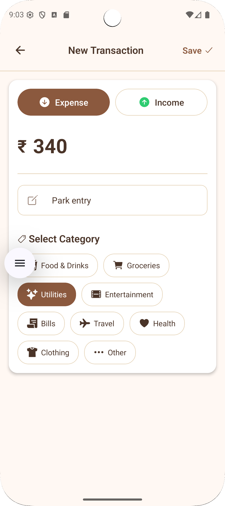

# 📊 Trackmate - Full-Stack Expense & Finance Tracker

A modern, full-stack mobile finance tracking application built with React Native, Expo, Express, and JavaScript, featuring secure authentication, real-time transaction updates, cloud storage, and a powerful backend powered by PostgreSQL (Neon).

Trackmate helps users manage income, expenses, and balances seamlessly across iOS and Android — all using JavaScript with no native Swift or Kotlin required.

---

## 📸 App Screenshots

<p align="center">
  <b>Authentication</b>&nbsp;&nbsp;&nbsp;&nbsp;&nbsp;&nbsp;&nbsp;&nbsp;
  <b>Add Expense</b>&nbsp;&nbsp;&nbsp;&nbsp;&nbsp;&nbsp;&nbsp;&nbsp;
  <b>Dashboard</b><br/><br/>

  
  
  
</p>

---

## ✨ Features

🔐 Secure Authentication: Clerk email verification with 6-digit OTP  
📝 Signup & Login Flows: Passwordless email-based login  
🏠 Dashboard: View current balance and past transactions  
➕ Add Transactions: Create income or expense entries  
🗑️ Delete Transactions: Instantly updates balance  
🔄 Pull-to-Refresh: Manual refresh support  
🚪 Logout Support: Secure session handling  
☁️ Cloud Storage: Persistent database with Neon PostgreSQL  
📱 Cross Platform: Works on iOS & Android (simulator + real device)  
⚡ Full-Stack: Mobile app + Express backend  
🛡️ Rate Limiting: API protection using Redis  
🎨 Clean UI: Modern responsive mobile-first design  

---

## 🛠️ Tech Stack

| Technology | Purpose |
|-----------|---------|
| React Native | Mobile development |
| Expo | App build & testing |
| JavaScript | Core programming language |
| Expo Router | Navigation |
| Clerk | Authentication & email verification |
| Express.js | Backend REST API |
| Neon PostgreSQL | Cloud database |
| Redis (Upstash) | Rate limiting |
| Node.js | Backend runtime |
| SecureStore | Secure token storage |

---

## 📂 Project Structure

```
Trackmate/
    mobile/
        app/
        components/
        screens/
        hooks/
        assets/
        package.json

    backend/
        src/
            routes/
            controllers/
            middleware/
            server.js
        package.json
```

---

## ⚙️ Environment Variables

### 📱 Mobile (.env)

```
EXPO_PUBLIC_CLERK_PUBLISHABLE_KEY=your_clerk_key
EXPO_PUBLIC_API_URL=http://localhost:5000
```

---

### 🖥️ Backend (.env)

```
PORT=5000

DATABASE_URL=your_neon_database_url

CLERK_SECRET_KEY=your_clerk_secret_key

UPSTASH_REDIS_REST_URL=your_redis_url
UPSTASH_REDIS_REST_TOKEN=your_redis_token
```

---

## 🚀 Getting Started

### 1️⃣ Backend Setup

```
cd backend
npm install
npm run dev
```

Runs server on:
```
http://localhost:5000
```

---

### 2️⃣ Mobile Setup

```
cd mobile
npm install
npx expo start
```

Press:
- A → Android
- I → iOS
- W → Web

---

## 📡 API Endpoints

### Auth
POST /api/auth/verify

### Transactions
GET /api/transactions  
POST /api/transactions  
DELETE /api/transactions/:id  

---

## 🔒 Security Features

✅ Clerk authentication  
✅ Email verification  
✅ Secure token storage  
✅ Redis rate limiting  
✅ CORS protection  
✅ Environment variable isolation  

---

## 📦 Deployment

### Backend
- Render / Railway / Fly.io

### Mobile
```
npx expo build
```

---

## 👨‍💻 Author

**Nischay Kumar**  
Full-Stack & React Native Developer

---

## ⭐ Support

If you like this project, give it a ⭐ on GitHub!
